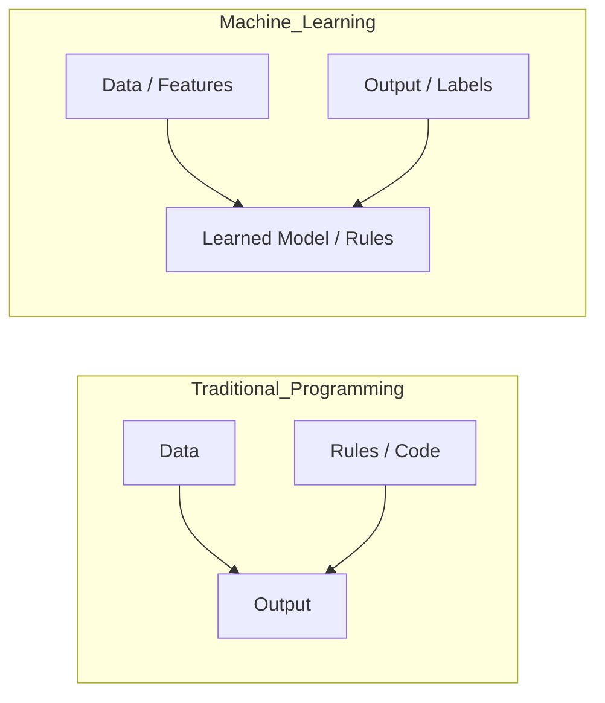
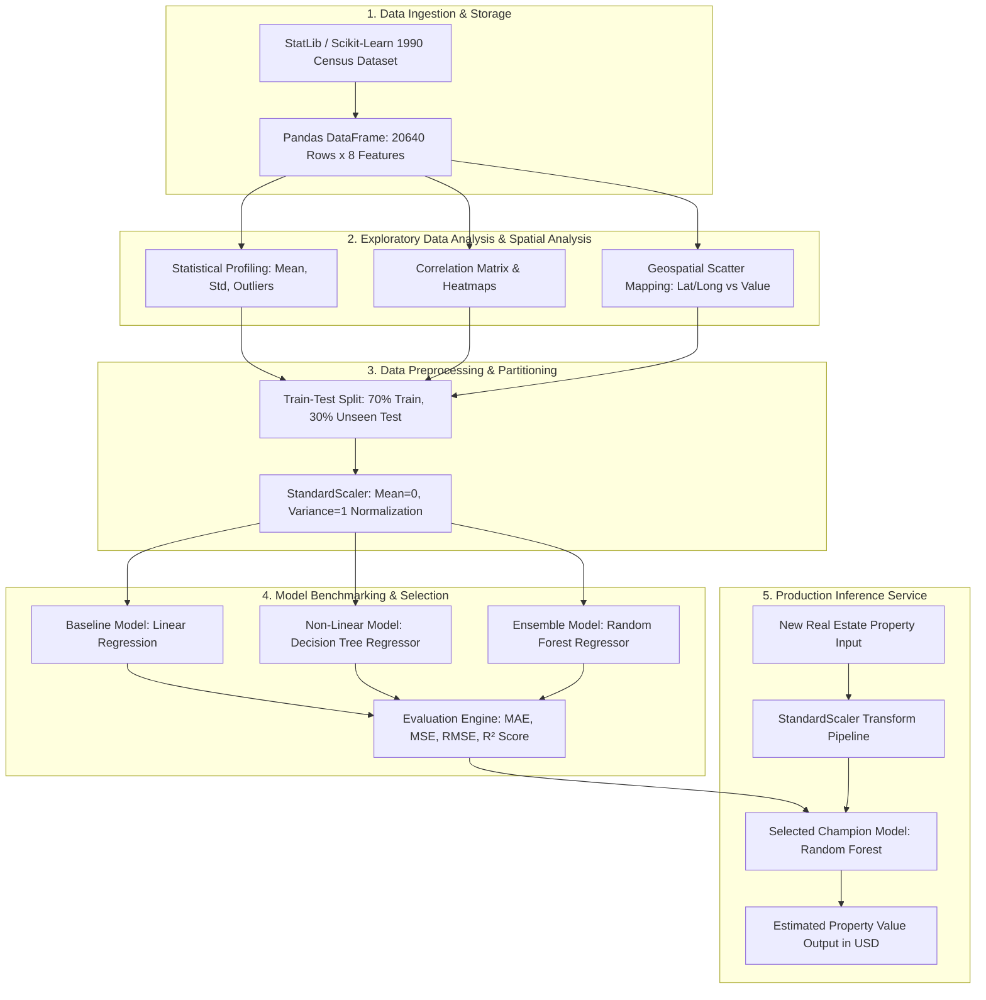
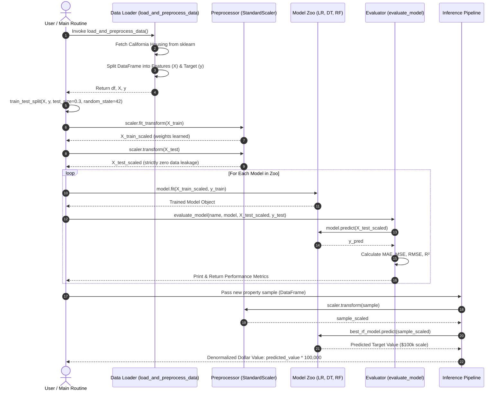
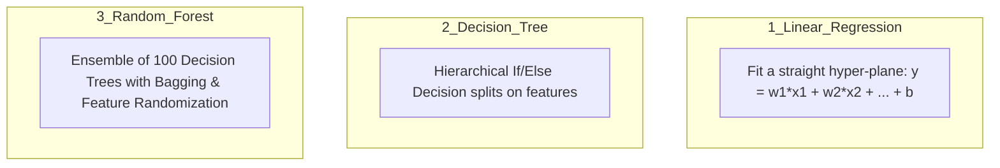
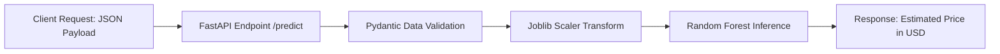

# 📘 The Ultimate Machine Learning Interview Master Handbook
### Project: California Housing Price Prediction End-to-End Pipeline
**Author:** Rohit Gangwar  
**Repository:** [https://github.com/irohitgangwar/house-price-prediction](https://github.com/irohitgangwar/house-price-prediction)

---

## 📑 Table of Contents
1. [Zero-to-Hero ML Fundamentals (Layman Intuition)](#1-zero-to-hero-ml-fundamentals-layman-intuition)
2. [Dataset Demystified: California Housing Data](#2-dataset-demystified-california-housing-data)
3. [Architecture: HLD & LLD (with Mermaid Diagrams)](#3-architecture-hld--lld)
4. [Line-by-Line Code Breakdown & Intuitive Explanation](#4-line-by-line-code-breakdown)
5. [The 3 Algorithms: Intuition, Math & Differences](#5-the-3-algorithms-in-depth)
6. [Metric Defense Masterclass ($R^2$, MAE, MSE, RMSE)](#6-metric-defense-masterclass)
7. [The Master Interview Question & Answer Bank (50+ Questions)](#7-the-master-interview-qa-bank)
8. [Production, Deployment & Future Improvements](#8-production-deployment--future-roadmap)

---

# 1. Zero-to-Hero ML Fundamentals (Layman Intuition)

### 💡 What is Machine Learning? (The Cooking Recipe Analogy)
- **Traditional Programming:** You write the exact recipe (rules) + input ingredients (data) = the computer gives you food (output).
- **Machine Learning:** You give the computer 20,000 photos of dishes (data) and what they taste like (output) = the computer **discovers the recipe on its own (model)**.



### 🎯 Regression vs. Classification
- **Classification:** Predicting a **category/label** (e.g., "Is this email Spam or Not Spam?", "Will customer churn: Yes or No?").
- **Regression (Our Project):** Predicting a **continuous number/quantity** (e.g., "What will this house sell for?", "Stock price tomorrow", "Temperature").

### 🧩 Features ($X$) vs. Target ($y$)
- **Features ($X$):** The input clues (e.g., number of rooms, location, age of house, neighborhood income).
- **Target ($y$):** The answer we want to predict (e.g., Median House Value).

### ⚖️ Overfitting vs. Underfitting (The Student Exam Analogy)
- **Underfitting (High Bias):** A student who didn't study at all and guesses the same answer for everything. Performs poorly on both practice tests (Train data) and final exams (Test data). *Example: Linear Regression when data is non-linear.*
- **Overfitting (High Variance):** A student who memorized the exact questions and answers of the textbook word-for-word. Gets 100% on practice tests (Train data) but fails when questions are slightly modified in the exam (Test data). *Example: Single deep Decision Tree.*
- **Good Fit (Optimal Generalization):** A student who understands concepts and applies logic to solve brand-new questions. *Example: Tuned Random Forest Regressor.*

---

# 2. Dataset Demystified: California Housing Data

The dataset contains aggregated demographic and geographic metrics from the **1990 U.S. Census** across **20,640 census block groups** in California.

> **What is a "Block Group"?**  
> A block group is a small neighborhood cluster containing roughly 600 to 3,000 people.

### 🔍 Feature Breakdown Table

| Feature Name | Meaning in Plain English | Unit / Scale | Why it Matters for House Price |
| :--- | :--- | :--- | :--- |
| **`MedInc`** | Median Income in the neighborhood | Tens of thousands USD (e.g., `3.5` = $35,000/yr) | **#1 Most Important Feature:** Wealthier buyers buy more expensive homes. |
| **`HouseAge`** | Median age of houses in block | Years (e.g., `25.0` years) | Newer homes or historic high-demand homes affect price. |
| **`AveRooms`** | Average total rooms per household | Count (e.g., `5.4` rooms) | Measures house size. |
| **`AveBedrms`** | Average bedrooms per household | Count (e.g., `1.02` bedrooms) | Ratio of rooms to bedrooms reflects luxury vs congestion. |
| **`Population`** | Total people living in the block | Count (e.g., `1425` residents) | Population density affects demand. |
| **`AveOccup`** | Average people per household | Count (e.g., `3.0` people/house) | High occupancy often indicates cramped or lower-income blocks. |
| **`Latitude`** | Geographic North-South coordinate | Decimal degrees (e.g., `37.88`) | Coastal California vs Inland valley pricing disparity. |
| **`Longitude`** | Geographic East-West coordinate | Decimal degrees (e.g., `-122.23`) | Proximity to San Francisco Bay & Los Angeles coasts. |
| **`MedHouseVal` (Target)** | Median house price for the block | **Hundreds of thousands USD** (e.g., `2.0` = $200,000) | **The target variable to predict.** Capped at `5.00001` ($500k). |

---

# 3. Architecture: HLD & LLD

### 🏗️ High-Level Design (HLD)
The HLD represents the end-to-end data lifecycle from raw ingestion to model benchmarking and deployment inference.



---

### ⚙️ Low-Level Design (LLD)
The LLD describes the execution flow, function boundaries, and exact variable transformations inside [`House value prediction.py`](file:///d:/Placement/Projects/ml/House-value-prediction-using-machine-learning-/House%20value%20prediction.py).



---

# 4. Line-by-Line Code Breakdown

Let's dissect each line in [`House value prediction.py`](file:///d:/Placement/Projects/ml/House-value-prediction-using-machine-learning-/House%20value%20prediction.py):

### 🔹 1. Libraries & Dependencies
```python
import pandas as pd
import numpy as np
from sklearn.datasets import fetch_california_housing
from sklearn.model_selection import train_test_split
from sklearn.preprocessing import StandardScaler
from sklearn.linear_model import LinearRegression
from sklearn.tree import DecisionTreeRegressor
from sklearn.ensemble import RandomForestRegressor
from sklearn.metrics import mean_absolute_error, mean_squared_error, r2_score
```
- **`pandas (pd)`:** Used for data manipulation, creating 2D tabular DataFrames (rows and columns).
- **`numpy (np)`:** Fast linear algebra, multidimensional array operations, and mathematical calculations like square root (`np.sqrt`).
- **`fetch_california_housing`:** Loads the dataset directly from scikit-learn without needing external CSV files.
- **`train_test_split`:** Randomly divides dataset into training subset and testing subset.
- **`StandardScaler`:** Standardizes features by subtracting mean and scaling to unit variance ($z = \frac{x - \mu}{\sigma}$).
- **`LinearRegression, DecisionTreeRegressor, RandomForestRegressor`:** The 3 regression algorithm classes.
- **`mean_absolute_error, mean_squared_error, r2_score`:** Mathematical metric functions for regression evaluation.

---

### 🔹 2. Data Loading & Feature Splitting
```python
def load_and_preprocess_data():
    housing = fetch_california_housing(as_frame=True)
    df = housing.frame.copy()
    X = df.drop(columns=['MedHouseVal'])
    y = df['MedHouseVal']
    return df, X, y
```
- `as_frame=True`: Loads dataset directly as a Pandas DataFrame with column names rather than raw NumPy arrays.
- `df.drop(columns=['MedHouseVal'])`: Drops target column from $X$ so the model doesn't see the answer keys.
- `y = df['MedHouseVal']`: Isolates target column into a 1D vector $y$.

---

### 🔹 3. Train-Test Split (Preventing Cheating)
```python
X_train, X_test, y_train, y_test = train_test_split(
    X, y, test_size=0.3, random_state=42
)
```
- **`test_size=0.3`:** 70% data (14,448 rows) goes to training, 30% (6,192 rows) is reserved for testing.
- **`random_state=42`:** Seed for pseudo-random number generator. Ensures reproducibility (every time you run, you get the exact same split).

---

### 🔹 4. Feature Scaling (The Level Playing Field)
```python
scaler = StandardScaler()
X_train_scaled = scaler.fit_transform(X_train)
X_test_scaled = scaler.transform(X_test)
```
- **Why scale?** `Population` ranges in thousands (e.g., 2000), while `AveBedrms` is ~1.0. Without scaling, gradient-based or distance-based algorithms assume larger numbers are thousands of times more important.
- **`fit_transform(X_train)`:** Calculates $\mu$ (mean) and $\sigma$ (standard deviation) of the training data AND transforms it.
- **`transform(X_test)`:** Strictly transforms test data using the training parameters ($\mu, \sigma$).  
  > ⚠️ **Critical Interview Point:** Never call `fit_transform` on `X_test`. That would cause **Data Leakage** (the model would peek into the test set distribution).

---

### 🔹 5. Evaluation Function
```python
def evaluate_model(name: str, model, X_test, y_test):
    predictions = model.predict(X_test)
    mae = mean_absolute_error(y_test, predictions)
    mse = mean_squared_error(y_test, predictions)
    rmse = np.sqrt(mse)
    r2 = r2_score(y_test, predictions)
    ...
```
- Runs `model.predict(X_test)` to get predicted prices.
- Computes MAE, MSE, RMSE, and $R^2$ comparing actual `y_test` against `predictions`.

---

### 🔹 6. Inference on Unseen House
```python
sample_house = pd.DataFrame([{
    'MedInc': 7.325,
    'HouseAge': 30.0,
    'AveRooms': 5.984,
    'AveBedrms': 1.0238,
    'Population': 280.0,
    'AveOccup': 2.20,
    'Latitude': 37.88,
    'Longitude': -122.23
}])
sample_scaled = scaler.transform(sample_house)
predicted_price = best_model.predict(sample_scaled)[0]
print(f"Predicted Median House Value: ${predicted_price * 100000:,.2f}")
```
- Creates a DataFrame with 8 feature values.
- Scales the sample using `scaler.transform`.
- Predicts normalized value and multiplies by $100,000 to output the final currency estimate.

---

# 5. The 3 Algorithms in Depth



### 1. Linear Regression
- **Concept:** Draws the best straight line (or hyper-plane) through data points to minimize the sum of squared residuals (Ordinary Least Squares - OLS).
- **Formula:** $\hat{y} = w_1 x_1 + w_2 x_2 + \dots + w_n x_n + b$
- **Pros:** Fast, simple, highly interpretable (you can read the weights).
- **Cons:** Assumes strict linear relationship. Fails on complex spatial coordinates where coastlines create non-linear value jumps.

### 2. Decision Tree Regressor
- **Concept:** Asks a sequence of binary questions (e.g., `MedInc > 5.0?` $\to$ `Latitude < 35?`) to partition data into smaller rectangular feature bins. For each leaf, it predicts the average value of training samples in that bin.
- **Pros:** Captures non-linear relationships, handles interactions between features automatically.
- **Cons:** High tendency to **overfit** (memorize noise) and very high variance.

### 3. Random Forest Regressor (The Champion)
- **Concept:** A **Bagging (Bootstrap Aggregation)** ensemble of 100 diverse decision trees:
  1. **Bootstrapping:** Each tree is trained on a random sample of the training data (sampled with replacement).
  2. **Feature Randomness:** At each node split, only a random subset of features ($\approx \sqrt{p}$ or $p/3$) is considered.
  3. **Aggregation:** Final prediction is the arithmetic average of all 100 tree predictions ($\hat{y} = \frac{1}{N} \sum_{i=1}^N T_i(x)$).
- **Why it wins:** Individual tree errors cancel each other out. This dramatically reduces **variance** without increasing **bias**.

---

# 6. Metric Defense Masterclass

| Metric | Formula | Value in Our Project | Plain English Meaning & Defense |
| :--- | :---: | :---: | :--- |
| **$R^2$ Score** | $1 - \frac{\sum (y_i - \hat{y}_i)^2}{\sum (y_i - \bar{y})^2}$ | **0.81** (81%) | **Goodness of fit:** Our model explains **81% of total variance** in home prices. Outperforms baseline linear model ($R^2=0.60$) by 21%. |
| **MAE** | $\frac{1}{n} \sum \|y_i - \hat{y}_i\|$ | **0.33** | **Average error:** On average, our prediction is off by $0.33 \times \$100,000 = \mathbf{\$33,000}$. Robust to outliers. |
| **MSE** | $\frac{1}{n} \sum (y_i - \hat{y}_i)^2$ | **0.25** | Penalizes large errors exponentially. Useful mathematically for gradient optimization. |
| **RMSE** | $\sqrt{\text{MSE}}$ | **0.50** | **~$50,000:** Gives error in same units as target while being sensitive to severe outliers (e.g., $500k price caps). |

---

# 7. The Master Interview Q&A Bank

### 🎓 Category A: Project Overview & Elevator Pitch

#### Q1: "Can you walk me through this project?"
> **Answer:**  
> *"In this project, I developed an end-to-end Machine Learning pipeline to predict California median home values using census block data.  
> The workflow spans exploratory data analysis, geospatial mapping, standard feature scaling, and multi-model benchmarking comparing Linear Regression, Decision Trees, and Random Forest.  
> The Random Forest model achieved the best performance with an **$R^2$ score of 0.81** and a **Mean Absolute Error of 0.33** (~$33,000 average error margin), effectively capturing non-linear interactions between demographic income and coastal proximity."*

#### Q2: "What was the biggest challenge in this dataset?"
> **Answer:**  
> *"The biggest challenge was the complex non-linear spatial relationships between geographic coordinates (`Latitude`/`Longitude`) and housing values. In California, houses on the coast or in Silicon Valley command extreme price premiums compared to houses just a few miles inland with the same latitude. Simple linear models could not capture this spatial clustering, which is why ensemble tree-based models were essential."*

---

### 🔬 Category B: Data Preprocessing & Pipeline

#### Q3: "Why did you use StandardScaler instead of MinMaxScaler?"
> **Answer:**  
> *"MinMaxScaler compresses all features strictly between 0 and 1, making it highly sensitive to extreme outliers. If a neighborhood has an unusually high population or income, MinMaxScaler squeezes all normal data into a tiny range. `StandardScaler` standardizes features to zero mean ($\mu=0$) and unit variance ($\sigma=1$), preserving the distribution shapes and being significantly more robust to outliers."*

#### Q4: "What is Data Leakage and how did you prevent it?"
> **Answer:**  
> *"Data Leakage occurs when information from the test dataset leaks into the training pipeline before model training, leading to overly optimistic results that fail in production.  
> I prevented it by strictly performing `train_test_split` **before** applying `StandardScaler`. The scaler called `fit_transform()` only on `X_train` to learn $\mu$ and $\sigma$, and then used those same parameters to call `transform()` on `X_test`."*

#### Q5: "Why did you choose a 70/30 train-test split?"
> **Answer:**  
> *"With 20,640 records, a 70/30 split allocates ~14,448 samples for training (plenty of statistical power for tree models) and 6,192 samples for testing. Having over 6,000 unseen test samples ensures high statistical confidence in our evaluation metrics without overfitting."*

#### Q6: "Why is random_state=42 used everywhere?"
> **Answer:**  
> *"`random_state` is a seed for pseudo-random number generation. Setting it to a fixed integer like 42 guarantees deterministic reproducibility across runs, ensuring our train-test split and tree building can be verified and peer-reviewed by other engineers."*

---

### 🧠 Category C: Algorithm Deep Dive

#### Q7: "Why did Linear Regression fail with only an $R^2$ of 0.60?"
> **Answer:**  
> *"Linear Regression assumes a strictly additive and linear relationship: $y = w^T X + b$. But housing values exhibit complex non-linearities: for example, the price benefit of an extra room depends heavily on median neighborhood income and location. Because Linear Regression cannot model feature interactions without explicit manual polynomial features, it suffered from **high bias (underfitting)**."*

#### Q8: "Why did Decision Tree have low MAE on train data but fail on test data ($R^2 \approx 0.62$)?"
> **Answer:**  
> *"A standalone Decision Tree without depth constraints splits until every leaf contains pure training samples. It memorizes exact noise and outliers from the training set, causing **high variance (overfitting)**. When presented with unseen test data, its rigid boundaries generalize poorly."*

#### Q9: "How does Random Forest solve the overfitting problem of Decision Trees?"
> **Answer:**  
> *"Random Forest uses two key bagging techniques:  
> 1. **Bootstrap Aggregation:** It creates 100 different trees, each trained on a random bootstrap sample with replacement.  
> 2. **Feature Randomness:** At each node, it only tests a random subset of features.  
> This de-correlates the individual trees. When you average their 100 individual predictions, the individual errors cancel out mathematically, reducing variance by a factor of $\frac{1}{N}$ without increasing bias."*

#### Q10: "What does `n_estimators=100` and `n_jobs=-1` mean in Random Forest?"
> **Answer:**  
> - `n_estimators=100`: The forest will construct 100 distinct decision trees.  
> - `n_jobs=-1`: Tells scikit-learn to utilize all available CPU cores in parallel for building the trees, speeding up training time significantly.

---

### 📊 Category D: Metric Justification & Business Context

#### Q11: "Why do we care about both MAE and RMSE?"
> **Answer:**  
> - **MAE ($0.33 \to \$33k$):** Measures the average magnitude of errors with linear penalty. It is directly interpretable to real estate business stakeholders.  
> - **RMSE ($0.50 \to \$50k$):** Squares errors before taking the root, heavily penalizing large prediction mistakes. If RMSE is significantly higher than MAE, it signals that the model has occasional large outliers in its predictions."*

#### Q12: "The target variable has a cap at 5.0 ($500,000). How does this affect metrics?"
> **Answer:**  
> *"In the 1990 census, home values above $500k were artificially capped at 5.00001. This creates a vertical cluster of values at 5.0. For ultra-luxury homes, our model might predict $700k while the ground truth says $500k, causing artificially high MSE/RMSE penalties at the top boundary. In future iterations, we could either treat values $\ge 5.0$ as a separate classification task or apply right-censored Tobit regression."*

---

### 🛠️ Category E: Production & Real-World Engineering

#### Q13: "How would you deploy this model to production?"
> **Answer:**  
> *"1. **Model Serialization:** Save the trained `scaler` and `RandomForestRegressor` into a `.joblib` or ONNX pipeline bundle.  
> 2. **REST API Microservice:** Wrap the pipeline inside a **FastAPI** backend with a `/predict` endpoint validating inputs via Pydantic schemas.  
> 3. **Containerization:** Package the service inside a lightweight Docker container.  
> 4. **Cloud Hosting:** Deploy to AWS ECS / Google Cloud Run behind an API Gateway with latency monitoring."*

#### Q14: "How would you handle feature drift or data drift over time?"
> **Answer:**  
> *"Housing prices and inflation change rapidly. I would implement:  
> 1. **Drift Monitoring:** Use tools like Evidently AI or Great Expectations to compare incoming inference feature distributions (e.g., median income) against the training baseline via Kolmogorov-Smirnov statistical tests.  
> 2. **Automated Retraining:** Setup an automated CI/CD pipeline triggered monthly to retrain and benchmark model checkpoints against fresh housing transactions."*

---

# 8. Production Deployment & Future Roadmap



### 🚀 Future Enhancements to Mention in Interviews:
1. **Gradient Boosting Models:** Benchmark against **XGBoost**, **LightGBM**, and **CatBoost**, which often provide another 2-5% improvement in $R^2$ on tabular data.
2. **Feature Engineering:**
   - `RoomsPerPerson = AveRooms / AveOccup`
   - `BedroomsRatio = AveBedrms / AveRooms`
   - Distance to major metropolitan centers (San Francisco, Los Angeles) calculated via Haversine distance from coordinates.
3. **Hyperparameter Tuning:** Use `Optuna` or `GridSearchCV` to optimize `max_depth`, `min_samples_split`, and `n_estimators`.

---

> [!TIP]
> **Pro Interview Strategy:** Whenever asked a question, structure your answer in 3 parts:  
> 1. **Direct Concept** (What is it?)  
> 2. **Project Application** (How did you use it in this project?)  
> 3. **Result/Impact** (What metric/value did it produce?)
