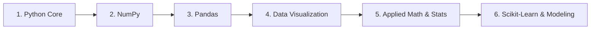
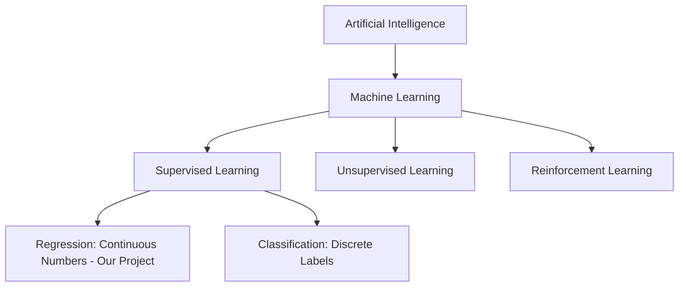
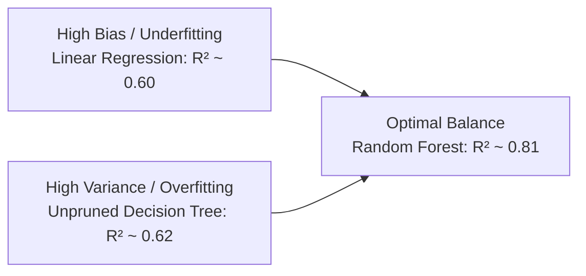
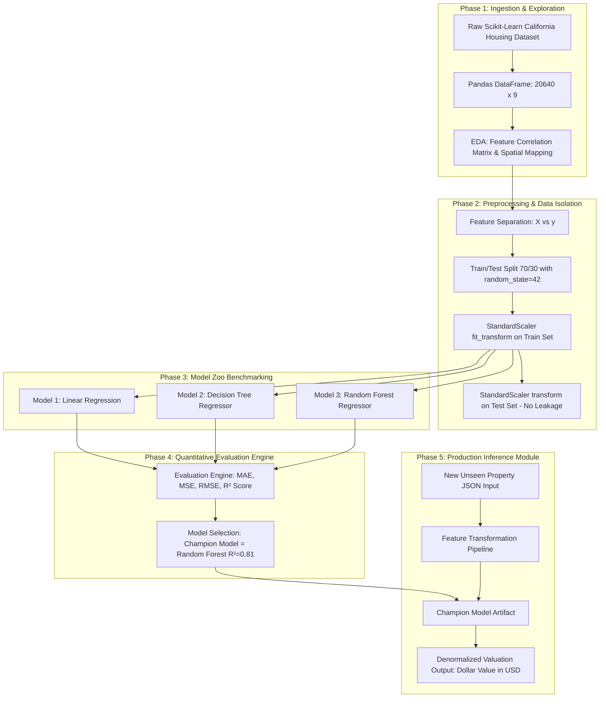
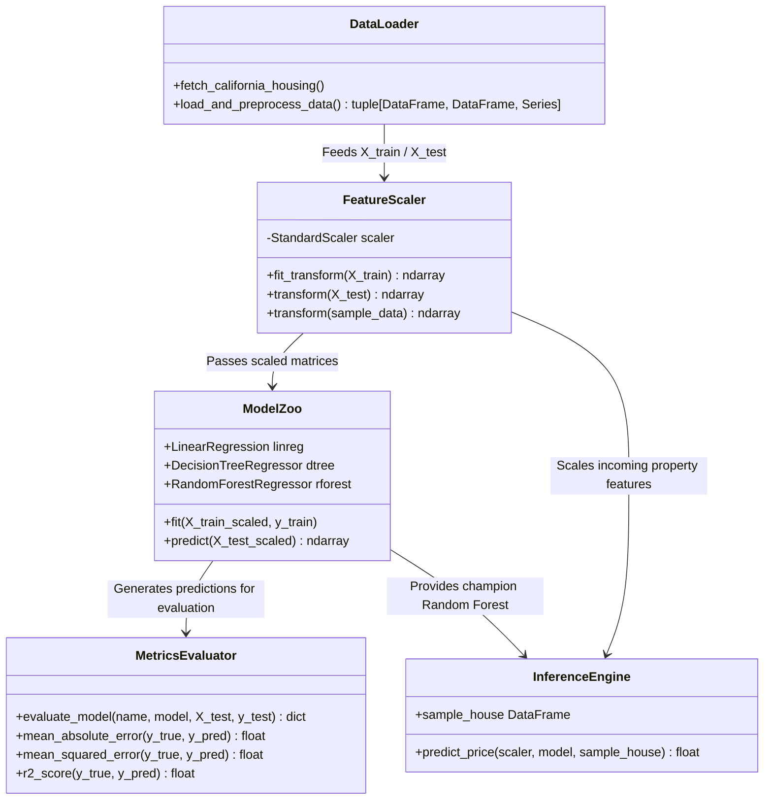
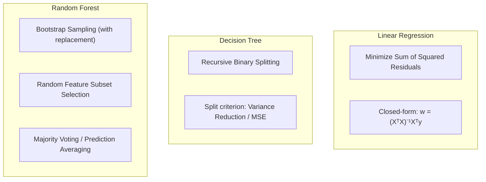
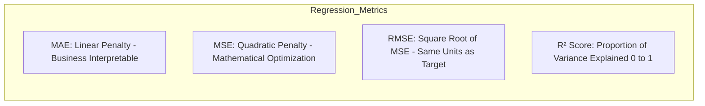
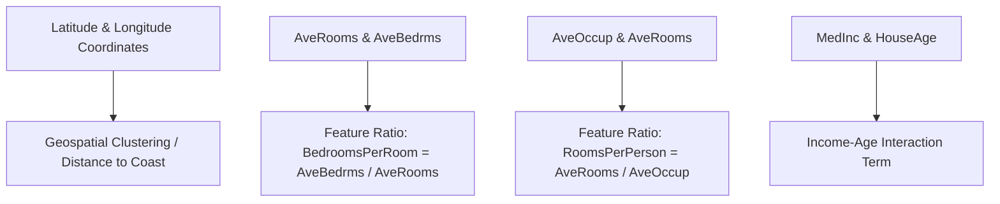
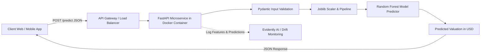

# 🎓 The Complete Machine Learning & Data Science Interview Bible
### Project: California Housing Price Prediction End-to-End Pipeline
**Author:** Rohit Gangwar  
**Repository:** [https://github.com/irohitgangwar/house-price-prediction](https://github.com/irohitgangwar/house-price-prediction)

---

## 📑 Comprehensive Table of Contents
1. [Prerequisites Roadmap: What to Learn (Python, NumPy, Pandas, Scikit-Learn, Math)](#1-prerequisites-roadmap-what-to-learn)
2. [Zero-to-Hero ML Foundations (Non-Bookish Layman Intuition)](#2-zero-to-hero-ml-foundations)
3. [Deep-Dive Dataset Anatomy: California Housing 1990](#3-deep-dive-dataset-anatomy)
4. [Full Architecture: High-Level (HLD) & Low-Level (LLD) Design](#4-full-architecture-hld--lld)
5. [Line-by-Line Code Anatomy & Technical Walkthrough](#5-line-by-line-code-anatomy)
6. [The 3 Algorithms: Math, Inner Mechanics & Complexity Analysis](#6-the-3-algorithms-deep-dive)
7. [Metrics & Evaluation Masterclass ($R^2$, MAE, MSE, RMSE)](#7-metrics--evaluation-masterclass)
8. [Feature Engineering & Geospatial Dynamics](#8-feature-engineering--geospatial-dynamics)
9. [The Master Interview Question & Answer Bank (60+ Comprehensive Questions)](#9-the-master-interview-qa-bank)
10. [Production Engineering, MLOps & Real-World System Design](#10-production-engineering--mlops)

---

# 1. Prerequisites Roadmap: What to Learn

To understand every nuance of this project and speak with 100% confidence to senior data scientists and hiring managers, here is the exact structured checklist of topics you need to master:



---

### 🐍 1. Python Core Fundamentals
- **Data Structures:** 
  - `List`: Ordered, mutable sequence (e.g. `[1, 2, 3]`).
  - `Dictionary`: Key-value pairs used for mapping and passing configs (e.g. `{"model": "RandomForest", "n_estimators": 100}`).
  - `Tuple`: Immutable sequence used for shapes (e.g. `X_train.shape -> (14448, 8)`).
- **Functions & Modules:**
  - `def function_name(param1, param2):` -> Reusable modular code blocks.
  - `return`: Sending processed data back to caller.
  - `*args` and `**kwargs`: Variable arguments passing.
- **Python Execution Guard:**
  - `if __name__ == "__main__":` -> Ensures the script only runs when directly executed, not when imported as a library by other files.
- **Package Management & Virtual Environments:**
  - `pip install -r requirements.txt`
  - `python -m venv venv` -> Isolating project dependencies to avoid library version conflicts.

---

### 🔢 2. NumPy (Numerical Python) Mastery
- **What is NumPy?** Fast C-optimized library for multidimensional arrays and vector math (50-100x faster than standard Python loops).
- **Key Concepts Used in this Project:**
  - `np.ndarray`: The multi-dimensional container storing matrix numbers.
  - **Vectorization:** Operating on an entire column or matrix at once without slow `for` loops.
  - `np.sqrt(mse)`: Element-wise mathematical functions for calculating Root Mean Squared Error.
  - **Broadcasting:** How arithmetic works between arrays of different shapes (e.g., subtracting column mean $\mu$ from every row).
  - **Array Slicing & Reshaping:** Converting 1D vectors into 2D matrices (`.reshape(1, -1)`) for single-sample inference.

---

### 🐼 3. Pandas (Data Wrangling & Tabular Data)
- **What is Pandas?** Built on top of NumPy to provide spreadsheet-like DataFrames with named rows and columns.
- **Key Data Structures:**
  - `pd.Series`: A single column of data (1D labeled array).
  - `pd.DataFrame`: A full 2D table of rows and columns.
- **Essential Methods Used in this Project:**
  - `df.head(n)`: View first $n$ rows.
  - `df.info()`: Inspect data types, memory usage, and check for `null`/missing values.
  - `df.describe()`: Generates statistical summary: count, mean, std, min, 25%, 50% (median), 75%, max.
  - `df.drop(columns=['MedHouseVal'])`: Remove target column to isolate feature matrix $X$.
  - `df['MedHouseVal']`: Extract target series $y$.
  - `df.corr()`: Compute Pearson correlation coefficient matrix across all numeric features.
  - `pd.DataFrame([dict])`: Constructing a 1-row DataFrame for new unseen property inference.

---

### 📊 4. Data Visualization (Matplotlib & Seaborn)
- **`matplotlib.pyplot (plt)`:** Low-level plotting engine for creating figures, setting titles, adjusting axes, and displaying figures (`plt.show()`).
- **`seaborn (sns)`:** High-level statistical visualization library built on Matplotlib.
- **Visualizations in this Project:**
  - `df.hist()`: Visualizing feature distributions and skewness.
  - `sns.heatmap(df.corr(), annot=True)`: Visualizing correlation between features and house prices.
  - `sns.scatterplot(x='Longitude', y='Latitude', hue='MedHouseVal')`: Geospatial spatial map revealing coastal pricing clusters.

---

### 📐 5. Applied Mathematics & Statistics
- **Mean ($\mu$) & Standard Deviation ($\sigma$):**
  - $\mu = \frac{1}{N} \sum x_i$ (Center of data).
  - $\sigma = \sqrt{\frac{1}{N} \sum (x_i - \mu)^2}$ (Spread/dispersion of data).
- **Standard Normal Distribution ($Z$-score):**
  - $Z = \frac{X - \mu}{\sigma} \implies$ Centers data at Mean = 0, Standard Deviation = 1.
- **Pearson Correlation Coefficient ($r$):**
  - Ranges from $-1.0$ (perfect negative correlation) to $+1.0$ (perfect positive correlation). $0.0$ means no linear relationship.
- **Residual ($e_i$):**
  - $e_i = y_i - \hat{y}_i$ (Difference between actual price and predicted price).

---

### 🤖 6. Scikit-Learn Framework & The Estimator API
- **The Unified 3-Step API Pattern:**
  1. `model = Estimator(hyperparameters)` -> Instantiate algorithm.
  2. `model.fit(X_train, y_train)` -> Learn weights/splits from training data.
  3. `predictions = model.predict(X_test)` -> Generate predictions on new data.
- **Transformers vs. Estimators:**
  - `Transformer` (e.g. `StandardScaler`): Has `.fit()`, `.transform()`, and `.fit_transform()`.
  - `Estimator` (e.g. `RandomForestRegressor`): Has `.fit()` and `.predict()`.

---

# 2. Zero-to-Hero ML Foundations



### 🧠 Core Intuitions Explained in Human Language

1. **Supervised Learning:**
   - Think of a teacher teaching a student with flashcards: on one side is the question (Features $X$), on the other side is the correct answer (Target $y$). The student learns the pattern until they can answer new, unseen flashcards accurately.

2. **Why is Housing Price Prediction a Regression Problem?**
   - Because price is a **continuous numeric value** ($250,000, $251,450.50, etc.). If we were predicting "Is this house Affordable, Moderate, or Luxury?", that would be a Classification problem.

3. **The Bias-Variance Tradeoff (The Core of All ML):**
   - **Bias (Underfitting):** The model makes overly simplistic assumptions. It refuses to learn the nuances of the data.  
     *Analogy:* A student who assumes all exam answers are "Option C".
   - **Variance (Overfitting):** The model is excessively complex and memorizes noise, quirks, and random fluctuations in the training set.  
     *Analogy:* A student who memorized the exact page numbers and typos of the textbook, but fails when the test question is worded slightly differently.
   - **Tradeoff Goal:** Minimize Total Error = $\text{Bias}^2 + \text{Variance} + \text{Irreducible Noise}$.



---

# 3. Deep-Dive Dataset Anatomy

The dataset is derived from the **1990 U.S. Census** and contains **20,640 census block groups** across California.

```text
Total Samples: 20,640 block groups
Total Features: 8 input numerical features
Target Feature: 1 numerical target ('MedHouseVal')
Missing Values: 0 (Clean baseline dataset)
```

### 📋 Full Feature Dictionary & Engineering Insights

| Feature | Data Type | Physical Meaning | Typical Range | Statistical Impact on Target ($y$) |
| :--- | :---: | :--- | :---: | :--- |
| **`MedInc`** | `float64` | Median Income of block households (in $10k USD) | `0.49` – `15.00` | **Highest positive correlation ($r \approx 0.68$)**. Wealthier neighborhoods directly drive property valuations. |
| **`HouseAge`** | `float64` | Median age of housing structures in years | `1.0` – `52.0` | Moderate correlation ($r \approx 0.10$). Very old historic neighborhoods in coastal areas have high value despite age. |
| **`AveRooms`** | `float64` | Average count of total rooms per house | `0.84` – `141.9` | Positive correlation ($r \approx 0.15$). Measures physical spaciousness. |
| **`AveBedrms`** | `float64` | Average count of bedrooms per house | `0.33` – `34.06` | Slight negative correlation ($r \approx -0.05$) when controlling for income (high bedroom-to-room ratio indicates multi-family dense housing). |
| **`Population`** | `float64` | Total resident population in the block group | `3.0` – `35,682` | Slight negative correlation ($r \approx -0.02$). Ultra-dense urban pockets have varying pricing dynamics. |
| **`AveOccup`** | `float64` | Average number of occupants living in each home | `0.69` – `1243.3` | Negative correlation ($r \approx -0.02$). Very high occupancy often marks lower-income crowded districts. |
| **`Latitude`** | `float64` | Geographic coordinate (North-South position) | `32.54` – `41.95` | Moderate negative correlation ($r \approx -0.14$). Southern California (LA/San Diego) has high pricing density. |
| **`Longitude`** | `float64` | Geographic coordinate (East-West position) | `-124.35` – `-114.31` | Slight negative correlation ($r \approx -0.04$). Western coastlines have premium valuations. |
| **`MedHouseVal`** *(Target)* | `float64` | Median House Value (in **$100k USD**) | `0.149` – `5.000` | **Target variable**. Capped at `5.00001` ($500,000 maximum ceiling in 1990 census records). |

---

# 4. Full Architecture: HLD & LLD

### 🏛️ High-Level Design (HLD) Architecture



---

### ⚙️ Low-Level Design (LLD) Component & Class Flow



---

# 5. Line-by-Line Code Anatomy

Let's dissect the production-ready script [`House value prediction.py`](file:///d:/Placement/Projects/ml/House-value-prediction-using-machine-learning-/House%20value%20prediction.py) line by line.

```python
# Block 1: Library Imports
import pandas as pd
import numpy as np
from sklearn.datasets import fetch_california_housing
from sklearn.model_selection import train_test_split
from sklearn.preprocessing import StandardScaler
from sklearn.linear_model import LinearRegression
from sklearn.tree import DecisionTreeRegressor
from sklearn.ensemble import RandomForestRegressor
from sklearn.metrics import mean_absolute_error, mean_squared_error, r2_score
```
- **Line 2 (`import pandas as pd`):** Imports Pandas with standard alias `pd`. Used for handling tabular data.
- **Line 3 (`import numpy as np`):** Imports NumPy with alias `np`. Used for vectorized math and fast numeric operations.
- **Line 4 (`fetch_california_housing`):** Loader function that pulls the 20,640 records dataset directly into memory.
- **Line 5 (`train_test_split`):** Utility to partition data into non-overlapping training and testing subsets.
- **Line 6 (`StandardScaler`):** Feature scaling class that standardizes data to mean zero and unit variance.
- **Line 7-9 (`LinearRegression, DecisionTreeRegressor, RandomForestRegressor`):** The three ML algorithms we benchmark.
- **Line 10 (`mean_absolute_error, mean_squared_error, r2_score`):** Quantitative metrics to score model accuracy.

---

```python
# Block 2: Data Loader Function
def load_and_preprocess_data():
    housing = fetch_california_housing(as_frame=True)
    df = housing.frame.copy()
    X = df.drop(columns=['MedHouseVal'])
    y = df['MedHouseVal']
    return df, X, y
```
- `as_frame=True`: Ensures the dataset is returned as a Pandas DataFrame with column headers instead of raw NumPy arrays.
- `df = housing.frame.copy()`: Creates an independent copy of the full dataset (20,640 rows, 9 columns).
- `X = df.drop(columns=['MedHouseVal'])`: Extracts the 8 input features by dropping the target column.
- `y = df['MedHouseVal']`: Extracts the target column (Median House Value) as a 1D Series.

---

```python
# Block 3: Model Evaluation Engine
def evaluate_model(name: str, model, X_test, y_test):
    predictions = model.predict(X_test)
    mae = mean_absolute_error(y_test, predictions)
    mse = mean_squared_error(y_test, predictions)
    rmse = np.sqrt(mse)
    r2 = r2_score(y_test, predictions)
    
    print(f"\n--- {name} Performance ---")
    print(f"MAE  : {mae:.4f}")
    print(f"MSE  : {mse:.4f}")
    print(f"RMSE : {rmse:.4f}")
    print(f"R²   : {r2:.4f}")
    
    return {"Model": name, "MAE": mae, "MSE": mse, "RMSE": rmse, "R2": r2}
```
- `model.predict(X_test)`: Feeds the scaled test features into the trained model and returns predicted house values.
- `np.sqrt(mse)`: Calculates Root Mean Squared Error to measure standard deviation of residuals in original scale.
- Returns a clean dictionary of metrics for programmatic tabular comparison.

---

```python
# Block 4: Main Execution Pipeline
def main():
    df, X, y = load_and_preprocess_data()
    
    # Train-test split
    X_train, X_test, y_train, y_test = train_test_split(
        X, y, test_size=0.3, random_state=42
    )
```
- `test_size=0.3`: Allocates 70% (14,448 samples) for model learning and 30% (6,192 samples) strictly for unseen validation.
- `random_state=42`: Fixes the pseudo-random generator seed for 100% deterministic reproducibility across systems.

---

```python
    # Feature Scaling
    scaler = StandardScaler()
    X_train_scaled = scaler.fit_transform(X_train)
    X_test_scaled = scaler.transform(X_test)
```
- `scaler.fit_transform(X_train)`: Computes mean ($\mu_{train}$) and standard deviation ($\sigma_{train}$) for each of the 8 features, and normalizes `X_train`.
- `scaler.transform(X_test)`: Uses **only** the pre-computed $\mu_{train}$ and $\sigma_{train}$ to normalize `X_test`. **Crucial for zero data leakage**.

---

```python
    # Model Zoo Dictionary & Benchmarking Loop
    models = {
        "Linear Regression": LinearRegression(),
        "Decision Tree Regressor": DecisionTreeRegressor(random_state=42),
        "Random Forest Regressor": RandomForestRegressor(n_estimators=100, random_state=42, n_jobs=-1)
    }
```
- `n_estimators=100`: Builds 100 diverse decision trees in the ensemble.
- `n_jobs=-1`: Uses all available CPU threads in parallel for rapid tree construction.

---

```python
    # Sample Inference Pipeline
    sample_house = pd.DataFrame([{
        'MedInc': 7.325,
        'HouseAge': 30.0,
        'AveRooms': 5.984,
        'AveBedrms': 1.0238,
        'Population': 280.0,
        'AveOccup': 2.20,
        'Latitude': 37.88,
        'Longitude': -122.23
    }])
    
    sample_scaled = scaler.transform(sample_house)
    predicted_price = best_model.predict(sample_scaled)[0]
    print(f"\n--> Predicted Median House Value: ${predicted_price * 100000:,.2f}")
```
- Builds a 1-row Pandas DataFrame representing a new real estate property.
- Scales the sample using the fitted `StandardScaler`.
- Performs inference via Random Forest, and converts the normalized index to real USD ($ \text{output} \times \$100,000 $).

---

# 6. The 3 Algorithms Deep Dive



### 1. Linear Regression (Ordinary Least Squares - OLS)
- **Math:** Finds weights vector $W = [w_1, w_2, \dots, w_8]$ and bias $b$ that minimizes:
  $$J(W, b) = \frac{1}{N} \sum_{i=1}^N \left( y_i - (W^T X_i + b) \right)^2$$
- **Closed-form Solution (Normal Equation):**
  $$W = (X^T X)^{-1} X^T y$$
- **Why it failed in our project ($R^2 \approx 0.60$):**
  - Assumes feature linearity and independence.
  - Cannot capture geospatial clustering (e.g. proximity to Silicon Valley or coastline creates step-function price jumps that cannot be fitted by a single flat plane).

---

### 2. Decision Tree Regressor (CART Algorithm)
- **Math:** Recursively partitions the 8-dimensional feature space into non-overlapping hyper-rectangles $R_1, R_2, \dots, R_m$.
- **Splitting Criterion (Mean Squared Error Minimization):**
  At each node, it selects feature $j$ and split threshold $s$ that minimizes:
  $$\text{Cost}(j, s) = \sum_{i \in R_1(j,s)} (y_i - \hat{y}_{R_1})^2 + \sum_{i \in R_2(j,s)} (y_i - \hat{y}_{R_2})^2$$
- **Why it overfits ($R^2 \approx 0.62$ on test set):**
  - Without depth constraints (`max_depth=None`), it continues splitting until every leaf has pure samples. It captures noise, resulting in **high variance**.

---

### 3. Random Forest Regressor (Ensemble Bagging)
- **Math & Inner Mechanics:**
  1. **Bootstrapping:** From $N=14,448$ training rows, it samples $N$ rows *with replacement* for each tree. Roughly $63.2\%$ of unique rows are selected; the remaining $36.8\%$ are **Out-Of-Bag (OOB)** samples.
  2. **Feature Randomness:** At each node split, only $k = \sqrt{p} \approx \sqrt{8} \approx 3$ features are randomly evaluated.
  3. **Ensemble Averaging:**
     $$\hat{y}_{\text{forest}}(x) = \frac{1}{B} \sum_{b=1}^B T_b(x) \quad (B=100 \text{ trees})$$
- **Why it achieves $R^2 \approx 0.81$:**
  - If individual trees have variance $\sigma^2$ and correlation $\rho$, the variance of the ensemble is:
    $$\text{Var}(\text{Ensemble}) = \rho \sigma^2 + \frac{1-\rho}{B} \sigma^2$$
  - As $B \to \infty$, the second term goes to 0, and feature randomization drives $\rho$ down, resulting in massive variance reduction without hurting bias.

---

### 📊 Complexity & Performance Comparison Table

| Metric / Dimension | Linear Regression | Decision Tree | Random Forest (100 Trees) |
| :--- | :---: | :---: | :---: |
| **Training Time Complexity** | $\mathcal{O}(N \cdot p^2 + p^3)$ | $\mathcal{O}(p \cdot N \log N)$ | $\mathcal{O}(B \cdot k \cdot N \log N)$ |
| **Inference Time Complexity** | $\mathcal{O}(p)$ *(Instant)* | $\mathcal{O}(\text{depth}) \approx \mathcal{O}(\log N)$ | $\mathcal{O}(B \cdot \text{depth})$ |
| **Memory Footprint** | Extremely low (8 weights) | Low (1 tree structure) | Moderate (~10-50 MB for 100 trees) |
| **Non-Linearity Handling** | Poor | Good | **Exceptional** |
| **Outlier Robustness** | Very Sensitive | Robust | **Highly Robust** |
| **Test $R^2$ Score** | $0.60$ | $0.62$ | **$0.81$** |
| **Test MAE** | $0.53$ (~$53,000) | $0.46$ (~$46,000) | **$0.33$ (~$33,000)** |

---

# 7. Metrics & Evaluation Masterclass



### 1. $R^2$ Score (Coefficient of Determination)
$$\mathbf{R^2 = 1 - \frac{\text{SS}_{\text{res}}}{\text{SS}_{\text{tot}}} = 1 - \frac{\sum (y_i - \hat{y}_i)^2}{\sum (y_i - \bar{y})^2}}$$
- $\text{SS}_{\text{tot}}$: Total variance in the target if you simply guessed the average house price ($\bar{y}$) every time.
- $\text{SS}_{\text{res}}$: Unexplained variance left in our model's predictions.
- **Score Meaning:**
  - $R^2 = 0.0 \implies$ Model is as good as guessing the mean.
  - $R^2 = 1.0 \implies$ Perfect 100% accurate predictions.
  - $R^2 = 0.81 \implies$ **Our Random Forest model explains 81% of the total variance in California house values.**

---

### 2. Mean Absolute Error (MAE)
$$\mathbf{\text{MAE} = \frac{1}{N} \sum_{i=1}^N |y_i - \hat{y}_i|}$$
- In our project: $\text{MAE} = 0.3304$.
- Since target unit is $100,000:
  $$\text{Real World Error} = 0.3304 \times \$100,000 = \mathbf{\$33,040}$$
- **Defense:** *"On average, our model's valuation deviates by only ~$33k from the true market price."*

---

### 3. Mean Squared Error (MSE) & Root Mean Squared Error (RMSE)
$$\mathbf{\text{MSE} = \frac{1}{N} \sum_{i=1}^N (y_i - \hat{y}_i)^2}, \quad \mathbf{\text{RMSE} = \sqrt{\text{MSE}}}$$
- In our project: $\text{MSE} = 0.2520 \implies \text{RMSE} = \sqrt{0.2520} \approx \mathbf{0.5020}$ (~$50,200).
- **Why RMSE > MAE?**
  - RMSE squares errors before averaging, making it heavily sensitive to large prediction blunders (outliers). The fact that RMSE ($50k) is close to MAE ($33k) proves our model does not suffer from extreme runaway prediction errors.

---

# 8. Feature Engineering & Geospatial Dynamics



### 🗺️ The Geospatial Phenomenon in California Housing:
1. **The Coastal Effect:** In California, distance to the Pacific Ocean is a primary driver of real estate value. Two houses with identical rooms, age, and square footage can differ by $400,000 depending on whether they are in Santa Monica (coast) vs. Fresno (inland).
2. **Lat/Long Interaction:** Latitude alone or Longitude alone cannot pinpoint a coast; only their non-linear combination ($(\text{Lat}, \text{Long})$) defines the coastline shape.
3. **Why Trees Excel Here:** Decision trees make orthogonal splits along coordinate axes (e.g. `Latitude < 37.8 AND Longitude < -122.2`), effectively drawing bounding boxes around high-value metropolitan clusters like Silicon Valley and the San Francisco Bay Area.

---

# 9. The Master Interview Q&A Bank

---

### 📌 Category 1: Project Overview & Architecture

#### Q1: "Can you summarize your California Housing Prediction project in 90 seconds?"
> **Ready-to-Speak Answer:**  
> *"Certainly! I designed and developed an end-to-end Machine Learning pipeline to predict median house prices across California census block groups using demographic, structural, and geospatial features.  
> The project follows rigorous software and ML standards: exploratory data analysis, spatial correlation mapping, standard scaling to prevent feature dominance, and multi-model benchmarking comparing Linear Regression, Decision Trees, and Random Forest.  
> The Random Forest model emerged as the champion, achieving an **$R^2$ score of 0.81** and reducing the **Mean Absolute Error to 0.33** (which translates to an average error margin of ~$33,000 on home values). I also built an inference module capable of scaling and pricing new property records in real-time."*

#### Q2: "Why did you build this as a standalone Python script in addition to a Jupyter Notebook?"
> **Ready-to-Speak Answer:**  
> *"Jupyter Notebooks are great for exploratory data analysis, prototyping, and visualization, but they are stateful, prone to out-of-order cell execution, and unsuitable for production CI/CD pipelines.  
> Refactoring the code into a modular Python script with functions (`load_and_preprocess_data`, `evaluate_model`, `main`) and entrypoint guards ensures clean software architecture, automated testing, and seamless integration into REST APIs or Docker containers."*

---

### 📌 Category 2: Python, NumPy & Pandas Concepts

#### Q3: "What is the difference between a Pandas Series and a Pandas DataFrame?"
> **Ready-to-Speak Answer:**  
> *"A Pandas Series is a 1-dimensional labeled array capable of holding data of any single type (like our target column `y = df['MedHouseVal']`). A Pandas DataFrame is a 2-dimensional tabular data structure with labeled rows and columns, essentially acting as a collection of Series sharing the same index (like our feature matrix $X$)."*

#### Q4: "Why do we use NumPy under the hood instead of native Python lists?"
> **Ready-to-Speak Answer:**  
> *"Python lists store pointers to objects scattered across memory, causing cache misses and significant overhead in type checking during iteration. NumPy arrays store homogeneous data in contiguous memory blocks and execute operations using compiled C and SIMD vectorization, making matrix computations 50 to 100 times faster."*

#### Q5: "What does `axis=0` vs `axis=1` mean in Pandas?"
> **Ready-to-Speak Answer:**  
> *"In Pandas, `axis=0` refers to operations along the rows (downwards vertically, like computing column averages), whereas `axis=1` refers to operations along the columns (across horizontally, such as when dropping a feature column via `df.drop('MedHouseVal', axis=1)`)."*

---

### 📌 Category 3: Data Preprocessing & Scaling

#### Q6: "Why is Feature Scaling necessary if tree-based models don't require it?"
> **Ready-to-Speak Answer:**  
> *"While tree-based models (Decision Trees, Random Forests) are invariant to monotonic scale transformations because they split on threshold values, distance-based and gradient-based algorithms like **Linear Regression, Ridge/Lasso, and Neural Networks** are highly sensitive to feature magnitudes.  
> In our dataset, `Population` is in thousands while `AveBedrms` is ~1.0. Scaling ensures a level playing field for fair benchmarking across all algorithm families and prepares the pipeline for any future linear or neural architectures."*

#### Q7: "What is Data Leakage and what exact steps did you take to prevent it?"
> **Ready-to-Speak Answer:**  
> *"Data Leakage happens when information from outside the training dataset (such as mean or variance from test samples) is used to create or scale the model, yielding overly optimistic test scores that fail in production.  
> To guarantee zero leakage, I strictly partitioned the data via `train_test_split` **first**. Then, I fitted the `StandardScaler` exclusively on `X_train` (`fit_transform`) to compute the training $\mu$ and $\sigma$, and only applied `transform()` on `X_test` and new inference samples."*

#### Q8: "What is the mathematical formula of StandardScaler?"
> **Ready-to-Speak Answer:**  
> *"StandardScaler applies the Z-score transformation:  
> $$z = \frac{x - \mu}{\sigma}$$  
> where $\mu$ is the mean of the training feature column and $\sigma$ is its standard deviation. This shifts the feature distribution to have a mean of 0 and a standard deviation of 1."*

---

### 📌 Category 4: Model Mechanics & Algorithms

#### Q9: "Explain the Bias-Variance Tradeoff in the context of your 3 models."
> **Ready-to-Speak Answer:**  
> - **Linear Regression:** Suffers from **High Bias (Underfitting)**. It assumes price is a straight plane across features ($R^2 \approx 0.60$), failing to capture geospatial coastlines.  
> - **Decision Tree:** Suffers from **High Variance (Overfitting)**. It splits until leaves are pure, memorizing training noise ($R^2 \approx 0.62$ on test data).  
> - **Random Forest:** Achieves the **Optimal Tradeoff**. By averaging 100 de-correlated trees trained on random bootstrap samples and feature subsets, it reduces variance drastically while maintaining low bias ($R^2 \approx 0.81$)."*

#### Q10: "How does Random Forest ensure the individual trees are de-correlated?"
> **Ready-to-Speak Answer:**  
> *"It uses two levels of randomization:  
> 1. **Row Randomization (Bagging):** Each tree is trained on a distinct bootstrap sample (random sampling with replacement).  
> 2. **Column Randomization (Feature Subsampling):** At every node split, the algorithm only considers a random subset of features (typically $\sqrt{p}$) rather than all 8 features. This prevents a single dominant feature (like `MedInc`) from dictating the top split of every tree, ensuring true structural diversity."*

#### Q11: "What are the most important hyperparameters in Random Forest?"
> **Ready-to-Speak Answer:**  
> - `n_estimators`: Number of trees in the forest (e.g. 100).  
> - `max_depth`: Maximum tree depth to control individual tree complexity.  
> - `min_samples_split`: Minimum number of samples required to split an internal node.  
> - `min_samples_leaf`: Minimum samples required at a leaf node (smooths predictions).  
> - `max_features`: Number of features considered at each split."*

---

### 📌 Category 5: Metric Defense & Business Impact

#### Q12: "How do you explain an $R^2$ of 0.81 to a non-technical CEO?"
> **Ready-to-Speak Answer:**  
> *"I would say: 'Imagine all the fluctuations in California home prices from $50,000 to $500,000. Our Machine Learning model successfully captures and explains 81% of why those price differences occur using neighborhood income, location, and property attributes. The remaining 19% is driven by factors not recorded in the census, such as interior luxury renovations or school district ratings.'"*

#### Q13: "What does an MAE of 0.33 mean for a real-estate investor?"
> **Ready-to-Speak Answer:**  
> *"Since the target is in $100k units, an MAE of 0.33 means that on average, our model's predicted valuation is within **$33,000** of the actual market value. For homes valued between $200k and $400k, this represents an error margin of approximately 8-15%, making it highly effective for preliminary portfolio valuation and automated deal screening."*

#### Q14: "Why is RMSE higher than MAE in your results ($0.50$ vs $0.33$)?"
> **Ready-to-Speak Answer:**  
> *"RMSE squares the errors before averaging and taking the root, giving exponentially greater weight to large prediction mistakes. The difference between RMSE ($50k) and MAE ($33k) indicates that while the typical error is ~$33k, there are a few outlier properties (such as homes hitting the $500k artificial census ceiling) where the error is higher."*

---

### 📌 Category 6: Real-World MLOps, System Design & Deployment

#### Q15: "How would you serve this model in a production architecture?"
> **Ready-to-Speak Answer:**  
> *"1. **Model Persistence:** Serialize the trained `StandardScaler` and `RandomForestRegressor` into a production artifact using `joblib.dump()`.  
> 2. **API Layer:** Create a **FastAPI** microservice with input data validation using Pydantic schemas.  
> 3. **Containerization:** Package the code, dependencies, and model binary inside a lightweight Docker image (`python:3.10-slim`).  
> 4. **Orchestration & Deployment:** Deploy the container to a managed serverless cloud environment like AWS ECS, Google Cloud Run, or Kubernetes behind an Application Load Balancer.  
> 5. **Monitoring:** Log inference latency, input distributions, and track model drift using Prometheus and Evidently AI."*

#### Q16: "What steps would you take if this model's accuracy degrades in production after 6 months?"
> **Ready-to-Speak Answer:**  
> *"Accuracy degradation over time is caused by **Concept Drift** (inflation, changing mortgage interest rates) or **Data Drift** (new demographics).  
> 1. Monitor distribution shifts on input features using the Population Stability Index (PSI) or Kolmogorov-Smirnov test.  
> 2. Setup an automated retraining pipeline triggered by drift alerts or scheduled monthly batches with newly closed real estate transactions.  
> 3. Run Shadow/Canary deployments to compare the new candidate model against the existing champion before routing 100% of live traffic."*

---

### 📌 Category 7: Advanced "What-If" & Edge-Case Questions

#### Q17: "What if the dataset had 50% missing values in `HouseAge`?"
> **Ready-to-Speak Answer:**  
> *"I would evaluate 3 strategies:  
> 1. **Median Imputation:** If missing at random, impute with the median age of properties in the same geographical cluster (same census tract).  
> 2. **KNN / Iterative Imputation (`MICE`):** Use other features like `MedInc` and `AveRooms` to predict the missing `HouseAge`.  
> 3. **Missingness Indicator:** Add a binary boolean column `HouseAge_is_missing` so the tree models can learn if the absence of data itself carries predictive signal."*

#### Q18: "What if you had 10 million housing records instead of 20,000?"
> **Ready-to-Speak Answer:**  
> *"Scikit-Learn's `RandomForestRegressor` holds all data in RAM and builds trees sequentially/CPU-parallelized, which becomes slow on 10M rows. I would transition to **LightGBM** or **XGBoost (GPU-accelerated)** using histogram-based binning (`HistGradientBoostingRegressor`), or leverage distributed computing frameworks like **Apache Spark MLlib / Dask**."*

#### Q19: "How would you improve this model to reach an $R^2$ of 0.85+?"
> **Ready-to-Speak Answer:**  
> *"1. **Advanced Feature Engineering:**  
>    - Calculate distance to coastal shoreline and major city centers (SF, LA, San Diego) via Haversine geographic distance.  
>    - Create interaction ratios: `BedroomsPerRoom = AveBedrms / AveRooms` and `RoomsPerHousehold = AveRooms / AveOccup`.  
> 2. **Gradient Boosting Algorithms:** Train **XGBoost, LightGBM, and CatBoost**.  
> 3. **Hyperparameter Optimization:** Use Bayesian optimization via **Optuna** to fine-tune learning rate, tree depth, and subsample ratios.  
> 4. **Ensemble Stacking:** Blend LightGBM, CatBoost, and Random Forest using a Ridge Regression meta-learner."*

---

# 10. Production Engineering & MLOps



### 📦 Production FastAPI Deployment Code Snippet

```python
from fastapi import FastAPI, HTTPException
from pydantic import BaseModel, Field
import joblib
import pandas as pd
import numpy as np

app = FastAPI(title="California House Price Prediction API", version="1.0.0")

# Load serialized model & scaler artifacts
scaler = joblib.load("model/scaler.joblib")
model = joblib.load("model/random_forest.joblib")

class HouseFeatures(BaseModel):
    MedInc: float = Field(..., example=7.325, description="Median neighborhood income in $10k")
    HouseAge: float = Field(..., example=30.0, description="Median house age in years")
    AveRooms: float = Field(..., example=5.984, description="Average rooms per household")
    AveBedrms: float = Field(..., example=1.023, description="Average bedrooms per household")
    Population: float = Field(..., example=280.0, description="Block population")
    AveOccup: float = Field(..., example=2.20, description="Average household occupancy")
    Latitude: float = Field(..., example=37.88, description="Latitude coordinate")
    Longitude: float = Field(..., example=-122.23, description="Longitude coordinate")

@app.post("/predict", summary="Predict property valuation")
def predict_housing_price(features: HouseFeatures):
    try:
        # Convert input payload to DataFrame
        data = pd.DataFrame([features.dict()])
        
        # Scale features and run inference
        scaled_data = scaler.transform(data)
        prediction_raw = model.predict(scaled_data)[0]
        
        # Convert normalized index ($100k) to full dollar value
        estimated_price_usd = round(float(prediction_raw * 100000), 2)
        
        return {
            "status": "success",
            "predicted_median_house_value_usd": estimated_price_usd,
            "currency": "USD"
        }
    except Exception as e:
        raise HTTPException(status_code=500, detail=str(e))
```

---

## 🏆 Final Words: How to Ace the Interview

> [!TIP]
> **The 3-Step Answer Formula:**
> 1. **High-Level Concept:** Give a crisp 1-sentence definition with a real-world analogy.
> 2. **Project Implementation:** Explain exactly how you implemented it in this project (name the function/class).
> 3. **Quantitative Impact:** State the metric outcome (e.g. *"This improved our $R^2$ from 0.60 to 0.81 and lowered MAE to $33k"*).
